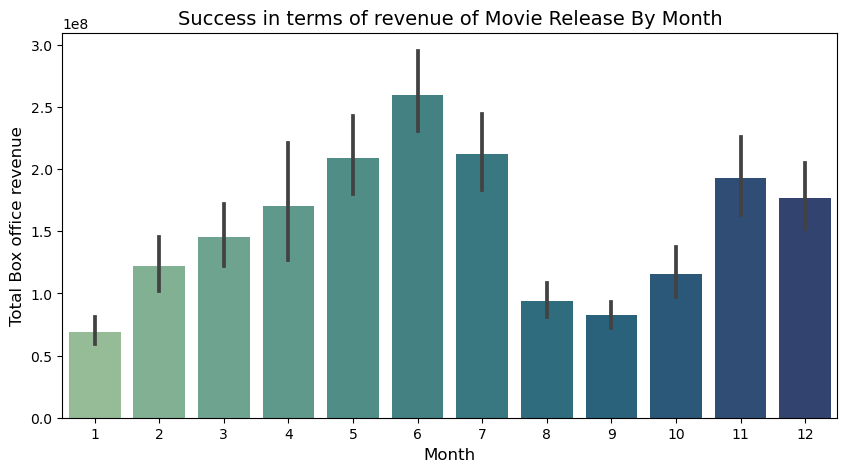
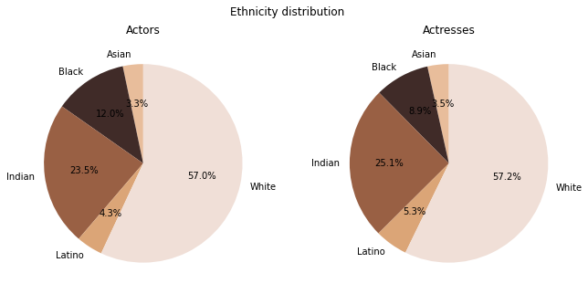

# What makes a movie successful?
## Table of contents
- [Abstract](#abstract)
- [Research Questions](#research-questions)
- [Proposed additional datasets and files](#proposed-additional-datasets-and-files)
- [Methods](#methods)
- [Proposed timeline](#proposed-timeline)
- [Organisation within the team](#organisation-within-the-team)

## Abstract

What makes a movie successful? While this question may seem like a low-hanging fruit, it requires a very holistic approach. A good film should not only make use of the 7th Art but of all seven Arts. A movie implies many choices: what genres to focus on, which director and actors bring the most added value, what budget to spend? With such a big movie database, we can expect to find some patterns for which those choices lead to more successful movies. But then again, what makes a movie successful? From profitability to perenniality, we shall investigate different success indicators. Ideally, the goal for our data story would be to draw a generator for the next successful movie: a user would select for instance a genre of interest and we would suggest the ideal combo of actors, director, budget, diversity, etc.

## Research Questions

Using our current and future analysis, we aim to answer the following questions:

- What budget should be invested for a successful film? 
- Which actors and directors bring the most added value to a movie?
- Investigate the correlation between the choice of genres and movie profitability. What genres are the most profitable?
- What is the link between an actor's success and his/her physical features (gender, age, height, ethnicity)
- What release months are most profitable? 
- What countries release the most profitable winning movie? Is this evolving with time? 
- What types of roles will be suitable for which actors?
- What are the best plot lines? (NLP, if possible)

## Proposed additional datasets and files

- [IMDB top 1000 movies dataset](https://www.kaggle.com/datasets/omarhanyy/imdb-top-1000): The goal of this dataset is to obtain information on IMDB ratings of different movies, directors, and actors. 
- [IMDB budget](https://github.com/jeremy-lee93/dsc-mod-1-project-v2-1-onl01-dtsc-pt-052620/blob/master/IMDb_budgets.csv): The added value of this dataset is mainly the budget spent and other features which we already have to complete NaN.
- Wikipedia pageview statistics for movies: dataset crowed from Wikipedia pageview statistics public API. `utils/extract_wikipedia_pageview_statistics.py` is the script for obtaining this dataset. Its input is a dataframe with movie names and its output is a dataframe with pageview statistics.

## Methods

### Step 1: Data loading
* `movies`: dataframe including information from CMU movies
* `characters`: dataframe including information from CMU movie characters
* `imdb_top_1000`: dataframe including information from top 1000 movies from IMDB
* `imdb_budget`: dataframe including information from 3828 IMDB movies
* `wikipedia_pageviews`: dataframe including information on movies’ daily average pageviews

### Step 2: Cleaning & Pre-processing of data

For all datasets: Convert number to correct data types (int, float). Check outliers either by web proofing (ex: check on the internet what is the minimum length of ever-made movies) or by common sense (ex: actor height cannot be above 4m). The other outliers are filtered. Replace corrupted elements when finding data on the internet. Remove encoding if there are any in the datasets. 

#### Step 2.1: Movies

Creation of a weighted IMDB rating to account for rating and number of votes. We also account for inflation rates to modify all revenue, profit, and budget with the US inflation rate since 1913.  Proceed with outer merge based on datasets movies, imdb_top_1000, imdb_budget, wikipedia_pageviews. The goal of this outer merge is to combine common features while conserving the original dataset length to still be able to investigate the data fully. The redundant columns between datasets are used to fill in missing values to have a more complete dataset. 

#### Step 2.2: Characters
The character dataset preprocessing work was aimed at finding the ethnicities of the characters/authors. The original dataset only provided freebase ids which had to be translated into “readable” ethnicity. To solve this problem, a script has been created to obtain the identifier-label equivalences from Wikidata. In addition, manual work has also been done classifying the main races. Five main groups are extracted to ease comparison: Black, Asian, Indian, Latin, and White people. All the implementation information can be found in the main file.

### Step 3: Exploratory analysis

#### Step 3.1: Movies
A movie involves very diverse features. A correlation heat map is created to investigate links between features. The focus is put on distribution and link to profitability and success on the following features: release month, genres, profit VS budget for top movies, actors, and directors.

<p>
  
</p>

#### Step 3.2: Characters
A movie is nothing without its actors. To analyze the success of a film, it is essential to look at its characters and by whom they are portrayed. The main objective of this point is to discover what are the characteristics that make an actor successful and, therefore, the film in which he participates. The character dataset allows us to study the main physical characteristics of the actors: gender, height, ethnicity, and age in which they participated in the movie. For instance, the following graph shows the distribution of ethnicities among actors and demonstrates the existence of a racial trend in the film industry

<p>
 
</p>

#### Step 3.3: Cross movies and characters results
For the next milestone and to determine the overall success of the films, the analyses made for the films and the characters or actors that have been made independently for this installment will be cross-referenced.

#### Step 3.4: Clustering movies according to plot type
Using the processed summaries with NLP we would analyze movie plots and try to separate them into clusters (happy ending vs sad ending…) (inspiration: “The Seven Basic Plots: Why We Tell Stories” - Christopher Booker).


#### Step 3.5: Countries

To assert how representative our dataset is of movies made in different parts of the world, we decided to plot the distribution of movies by country. As expected, we note that almost half the dataset is made up of American movies.
We also want to know if this distribution has maybe changed over time, so we separate the dataset approximately in two: movies made before 1985 and movies made after 1985 and we run the previous analysis on the two subsets. We can see that the United States dominates movie production (or at least the dataset) but that Indian cinema has become more and more important. We will keep looking into these relations for the next milestone.

### Step 4: Try to advise choices of features for a successful movie

Cluster all the above investigations across genres to advise the creation of successful movies. 

## Proposed timeline
* 21.11.22 Pause project for Homework 2.
* 02.12.22 Homework 2 deadline
* 10.12.22 Rough draft of the datastory.
* 15.12.22 Complete all code implementations and visualizations relevant to the analysis.
* 20.12.22 Complete datastory.
* 23.12.22 Milestone 3 deadline

## Organisation within the team

| Teammate| Task |
| --- | --- |
| Pau | Clustering of actor physical features and success across genres. |
| Mehdi | Investigate best plot lines across genres and differences between countries |
| Nikolay| Clustering genres into finite categories |
| Olivia| Find optimal budget across genres |
| All| Creation of the git webpage and interactive plots to find “the next successful movie” |

Text can be **bold**, _italic_, or ~~strikethrough~~.

[Link to another page](./another-page.html).

There should be whitespace between paragraphs.

There should be whitespace between paragraphs. We recommend including a README, or a file with information about your project.

# Header 1

This is a normal paragraph following a header. GitHub is a code hosting platform for version control and collaboration. It lets you and others work together on projects from anywhere.

## Header 2

> This is a blockquote following a header.
>
> When something is important enough, you do it even if the odds are not in your favor.

### Header 3

```js
// Javascript code with syntax highlighting.
var fun = function lang(l) {
  dateformat.i18n = require('./lang/' + l)
  return true;
}
```

```ruby
# Ruby code with syntax highlighting
GitHubPages::Dependencies.gems.each do |gem, version|
  s.add_dependency(gem, "= #{version}")
end
```

#### Header 4

*   This is an unordered list following a header.
*   This is an unordered list following a header.
*   This is an unordered list following a header.

##### Header 5

1.  This is an ordered list following a header.
2.  This is an ordered list following a header.
3.  This is an ordered list following a header.

###### Header 6

| head1        | head two          | three |
|:-------------|:------------------|:------|
| ok           | good swedish fish | nice  |
| out of stock | good and plenty   | nice  |
| ok           | good `oreos`      | hmm   |
| ok           | good `zoute` drop | yumm  |

### There's a horizontal rule below this.

* * *

### Here is an unordered list:

*   Item foo
*   Item bar
*   Item baz
*   Item zip

### And an ordered list:

1.  Item one
1.  Item two
1.  Item three
1.  Item four

### And a nested list:

- level 1 item
  - level 2 item
  - level 2 item
    - level 3 item
    - level 3 item
- level 1 item
  - level 2 item
  - level 2 item
  - level 2 item
- level 1 item
  - level 2 item
  - level 2 item
- level 1 item

### Small image


### Definition lists can be used with HTML syntax.

<dl>
<dt>Name</dt>
<dd>Godzilla</dd>
<dt>Born</dt>
<dd>1952</dd>
<dt>Birthplace</dt>
<dd>Japan</dd>
<dt>Color</dt>
<dd>Green</dd>
</dl>

```
Long, single-line code blocks should not wrap. They should horizontally scroll if they are too long. This line should be long enough to demonstrate this.
```

```
The final element.
```
